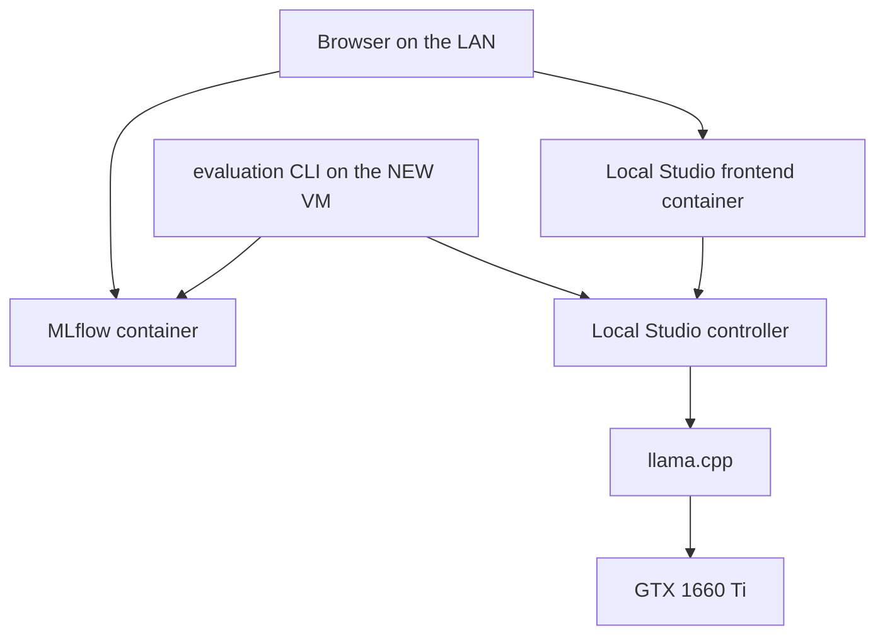

# Local Studio LLM lab

This checkout is the shared Git repository for a two-machine home lab:

- **OLD PC** (`192.168.0.69`) — Local Studio controller, llama.cpp, GGUF weights, GTX 1660 Ti
- **NEW VM** (`192.168.0.230`) — Local Studio frontend, MLflow, evaluation scripts

Model inference does **not** run on the NEW VM.

Repository: `git@github.com:Arno1235/local-studio.git`

## Architecture

```
                    NEW VM 192.168.0.230
       ┌────────────────────────────────────┐
       │ Docker: local-studio-frontend :4783│
       │ Docker: mlflow :5000               │
       │ Host: evaluation/ Python CLI       │
       └─────────────────┬──────────────────┘
                         │ LAN HTTP + API key
                         ▼
                    OLD PC 192.168.0.69
       ┌────────────────────────────────────┐
       │ Local Studio controller :8080      │
       │     llama.cpp llama-server :8081   │
       │     NVIDIA GeForce GTX 1660 Ti 6GB │
       └────────────────────────────────────┘
```



Only two primary Docker application containers run on the NEW VM: `local-studio-frontend` and `mlflow`. Postgres, Redis, MinIO, and Kubernetes are not part of this lab. MLflow uses SQLite plus a bind-mounted artifact directory.

## 1. OLD PC setup

See `old-pc-backend/README.md`. Short version:

- Controller listens on `192.168.0.69:8080` with `LOCAL_STUDIO_API_KEY`
- llama.cpp listens on `127.0.0.1:8081` and is not published
- Recipe `gemma-4-e4b-it-q4km` uses `n-gpu-layers=all`
- Frontend units stay disabled on that host
- GGUF files stay on that disk

## 2. NEW VM setup

```bash
cp .env.example .env
# set OLD_PC_LOCAL_STUDIO_API_KEY
bash new-vm/scripts/up.sh
bash new-vm/scripts/health.sh
```

`new-vm/scripts/` is used instead of `scripts/` because repository automation allows only the existing installer hooks under `scripts/`.

## 3. Docker services

| Service | Image build | Port | Persistence |
| --- | --- | --- | --- |
| `local-studio-frontend` | `new-vm/docker/frontend/Dockerfile` (Node 22.19.0) | 4783 | `data/frontend` |
| `mlflow` | `new-vm/docker/mlflow/Dockerfile` (MLflow 3.15.1) | 5000 | `data/mlflow` |

```bash
bash new-vm/scripts/up.sh
bash new-vm/scripts/down.sh
bash new-vm/scripts/status.sh
bash new-vm/scripts/logs.sh
bash new-vm/scripts/health.sh
```

Update: `bash new-vm/scripts/up.sh --build` after `git pull`.

## 4. Remote controller configuration

The frontend container gets:

- `BACKEND_URL=$OLD_PC_LOCAL_STUDIO_URL` (must be the OLD PC, never localhost)
- `API_KEY` / `LOCAL_STUDIO_API_KEY`
- `ALLOWED_LAN_HOSTS=true` so `http://192.168.0.230:4783` works over plain HTTP

The browser talks to the frontend; the frontend proxies to the controller. Do not point the UI at a second local controller.

Do **not** put `127.0.0.1:8081` in Settings. That is llama.cpp on the OLD PC loopback. From this VM the GPU is reached only through `http://192.168.0.69:8080`.

| Surface | What it talks to | Model / GPU |
| --- | --- | --- |
| Status, recipes, Chat | Frontend `/api/proxy` → OLD PC controller `:8080` | Yes, Gemma on the 1660 Ti |
| New Task (agent / terminal) | Frontend → **agent runtime inside this container** (`127.0.0.1:4784`) → then the same controller `:8080` for tokens | Yes, after the agent runtime is up |

If New Task says “no model” or the terminal shows `127.0.0.1`, Settings can still be connected: Chat/Status use the controller, while New Task needs the in-container agent runtime. Restart with `bash new-vm/scripts/up.sh --build` after this image includes that runtime.

## 5. MLflow configuration

- Tracking URI: `http://127.0.0.1:5000` on the VM, `http://192.168.0.230:5000` on the LAN
- Backend store: `sqlite:////mlflow/mlflow.db`
- Artifacts: `/mlflow/artifacts` bind-mounted to `data/mlflow`
- LAN UI: `--allowed-hosts '*'` and `--cors-allowed-origins '*'` so experiment charts can call `/ajax-api` from `http://192.168.0.230:5000`
- Experiments created on demand: `local-llm-performance`, `local-llm-quality`, `local-llm-comparisons`

## 6. Cloud judge configuration

**Off.** Default semantic judge is `cursor-manual`.

Cursor subscription does not provide general-purpose API credits for MLflow judges. A separate provider API key/account is required and may incur API charges. This lab does not ship `OPENAI_API_KEY` / `ANTHROPIC_API_KEY` / `GEMINI_API_KEY` variables. Setting `evaluation.semantic_judge` to a cloud provider fails closed.

## 7. Secrets

Live in gitignored `.env`. Use `.env.example`. Never commit API keys, `.env`, GGUF files, or MLflow SQLite databases.

## 8. First evaluation

```bash
bash new-vm/scripts/health.sh
bash new-vm/scripts/run-evaluation.sh run --suite smoke
bash new-vm/scripts/run-evaluation.sh run --suite standard
```

Target model: **Gemma 4 E4B IT Q4_K_M** (`gemma-4-e4b-it-q4km`) already loaded on the OLD PC. The NEW VM does not download weights.

The run is **FAILED** (not a baseline) if the model cannot be shown to reside on the GTX 1660 Ti without CPU-offloaded layers. Context may be lowered to keep full GPU residency; 8192 is the configured starting point.

Unattended smoke + served-path speed (`served-bench`) + EvalPlus HumanEval+ (Cursor on this VM): paste `evaluation/prompts/run-gpu-bench.md` after filling the Model card. Results go to `evaluation/reports/gpu-bench-<served-model-name>.md`. The OLD PC has no SSH; do not run `llama-bench` on that host.

## 9. Later evaluations

Same command, optionally `--suite extended` (warns: more samples, still no cloud judge) or another `--config`.

## 10. Benchmark interpretation

| Label | Meaning |
| --- | --- |
| Hardware benchmark | GPU name, VRAM, offload, utilization |
| Latency benchmark | TTFT, total latency |
| Generation benchmark | tok/s, token counts |
| Deterministic quality | exact/regex/JSON checks |
| Semantic LLM-judge | Cursor-manual or human import only |
| Standardized benchmarks | **Not implemented** — do not treat v1 as MMLU/HumanEval |

## 11. Adding a new model

1. Download and recipe on the OLD PC through Local Studio (or the controller API)
2. Keep weights on the OLD PC
3. Copy `evaluation/configs/gemma-4-e4b-it-q4km.yaml`, change `model.name` / quantization
4. Run evaluation

## 12. Comparing models

Walkthrough (speed, token efficiency, accuracy, MLflow UI): `evaluation/mlflow-model-comparison.md`.

```bash
bash new-vm/scripts/run-evaluation.sh compare --run-a RUN_A --run-b RUN_B
```

Use the same `datasets/v1` suite. Inspect side-by-side in MLflow (`local-llm-comparisons` plus the two source runs).

## 13. Troubleshooting

- Frontend `421 Host is not allowed` — `ALLOWED_LAN_HOSTS=true` and rebuild/restart frontend
- Frontend cannot see models — `.env` `OLD_PC_LOCAL_STUDIO_URL` / API key; `bash new-vm/scripts/health.sh`
- MLflow empty — evaluation CLI uses `MLFLOW_TRACKING_URI=http://127.0.0.1:5000`
- Slow or CPU-like tok/s — treat GPU-fit as failed; do not publish as the 1660 Ti baseline
- Old unrelated containers — they were stopped with `restart=no` on this VM

## 14. GPU-offload verification

The evaluator reads `/gpus`, `/status`, `/recipes`, `/compat`, `/v1/metrics/vllm`, and controller logs for `offloaded N/N layers to GPU`. It also requires VRAM use above a floor and generation tok/s above a GPU floor. Layer counts from llama.cpp logs are used when the controller exposes them; otherwise residency is inferred from VRAM + `n-gpu-layers=all` + CUDA and **not** labeled verified.

## 15. Backups

Copy `data/mlflow/` (SQLite + artifacts) and `data/frontend/`. Model weights are backed up on the OLD PC, not here.

## 16. Updating Local Studio

`git pull` on a feature branch, `bash new-vm/scripts/up.sh --build`. Do not run a second controller on the NEW VM.

## 17. Updating MLflow

Pin in `new-vm/docker/mlflow/Dockerfile`, rebuild the `mlflow` service. Keep the bind mount.

## 18. Git workflow

Branch from the current default (`main` on this fork), one agent per branch, conventional commits, PR; do not push to `main`/`dev` directly. `scripts/` layout and executable bits are gated by `npm run check`.

## 19. Security

Trusted LAN/VPN only. Publish 4783/5000 on the VM; do not port-forward them on the router. Controller stays on the OLD PC with an API key. Example UFW on the NEW VM:

```bash
sudo ufw default deny incoming
sudo ufw default allow outgoing
sudo ufw allow 22/tcp
sudo ufw allow from 192.168.0.0/24 to any port 4783 proto tcp
sudo ufw allow from 192.168.0.0/24 to any port 5000 proto tcp
sudo ufw enable
```

## Application source

`controller/` and `frontend/` remain the Local Studio product. Day-to-day product docs: `controller/README.md`, `frontend/README.md`.
